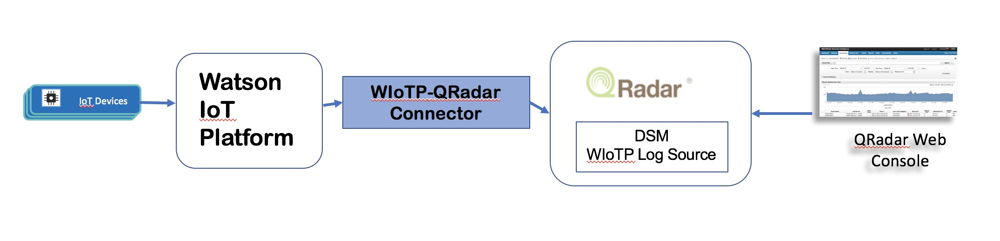

# IBM® Watson™ IoT Platform and IBM® QRadar® SIEM Integration

IBM® QRadar® Security Information and Event Management (SIEM) platform that can collect,
process, aggregate and store data in real time from network devices and applications,
and use the collected data to manage network security by providing real-time information and
monitoring, alerts and offenses, and responses to network threats.

This project contains a connector application that can be used for integrating IBM® Watson™ IoT Platform
with IBM® QRadar® SIEM to get connection level security insights of IoT Devices. The following
diagram shows the high level flow:



This project also describes the steps needed to configure QRadar platform to ingest data from 
the connector application and provides some sample rules to get security insights. 

## Prerequisite

To try the integration described in this project, you need an IBM Cloud account,  an instance 
of IBM Watson IoT service in your IBM Cloud organization with some devices connected to your
IBM Watson IoT service, and IBM QRadar SIEM installation.

If you do not have an IBM Cloud account, [sign up](https://console.bluemix.net/registration/) for an IBM Cloud account.

If you do not have an instance of IBM Watson IoT Platform service,
[create an instance](https://console.bluemix.net/catalog/services/internet-of-things-platform/)
in your IBM Cloud organization. You can create [large number of simulated decvices](https://console.bluemix.net/docs/services/IoT/getting_started/getting-started-iot-large-scale-simulation.html#guide-3-simulating-a-large-number-of-devices) to test.

If you do not have IBM QRadar SIEM platform installation, refer to the following link:
[IBM QRadar SIEM](https://www.ibm.com/us-en/marketplace/ibm-qradar-siem).


## WIoTP QRadar Connector Application

This application performs the following tasks:
- Makes REST calls to get connection logs from WIoTP
- Normalizes the data needed for QRadar integration
- Generates and sends syslog events to QRadar platform

### Dependencies

- [Python 3.6](https://www.python.org/downloads/release/python-360/)
- [Python 2.7](https://www.python.org/downloads/release/python-2713/)
- [IBM Watson IoT Platform Python client library](https://github.com/ibm-watson-iot/iot-python)

Note: Support for MQTT with TLS requires at least Python v2.7.9 or v3.4, and openssl v1.0.1

### Deploy in IBM Cloud

You can deploy this application as Cloud Foundary application in IBM Cloud.
Before you begin, download and install the IBM Cloud command line interface. 

- [IBM Cloud CLI] (https://clis.ng.bluemix.net/)

Clone this repository locally:

```
git clone <this base URL>

For example:
git clone https://github.com/ibm-watson-iot/qradar-connector
```

Change to the directory where your code is located.

```
cd radar-wiotp-collector
```

Take note of the manifest.yml file. When deploying your app back to IBM Cloud, this file is used to 
determine your application’s URL, memory allocation, number of instances, and other crucial 
parameters. You can read more about the manifest file in the Cloud Foundry documentation.

Make changes to your manifest.xml file to specify an unique name for the connector application:

```
applications:
- path: .
  memory: 256M
  instances: 1
  name: <your Watson IoT Platform organization id>-qradar-connector
  host: <your Watson IoT Platform organization id>-qradar-connector
  disk_quota: 1024M
```

Example manifest.xml file

```
applications:
- path: .
  memory: 256M
  instances: 1
  name: ui1f0v-qradar-connector
  host: ui1f0v-qradar-connector
  disk_quota: 1024M
```


Make changes to your application.cfg 

```
[application]
org = <your Watson IoT Platform organization id>
auth-method = token
auth-key = <API Key>
auth-token = <API Token>

[qradar-syslog-server]
hostip = <Host IP of QRadar SYSLOG server. Default 127.0.0.1>
port = <Port of QRadar SYSLOG server. Default 514>

[qradar-connector]
device-fetch-limit = <Number of devices processed in a batch. Default 100>
log-fetch-limit = <Connection log fetch stretagy. 0 (use time period), number (use limit), -1 (get all)>
log-fetch-interval = <Log fetch pooling interval in seconds. Default 10>
verbose = 0
```


Example application.cfg
```
[application]
org = ui1f0v
auth-method = token
auth-key = a-ui1f0v-saxzblldvv
auth-token = tD_yyAXN7tsGw5T7dj

[qradar-syslog-server]
hostip = 10.78.169.83
port = 514

[qradar-connector]
device-fetch-limit = 100
log-fetch-limit = -1
log-fetch-interval = 10
verbose = 0

```

Connect and log in to IBM Cloud.

```
bluemix api https://api.ng.bluemix.net
bluemix login -u <IBMid> -o org_name -s space_name
```

If you are using a federated ID, use the -sso option.

```
bluemix login  -o org_name -s space_name -sso
```

Note: You must add single or double quotes around username, org_name, and space_name if 
the value contains a space, for example, -o "my org". From your_new_directory, deploy your app 
to IBM Cloud by using the bluemix app push command. 
For more information about the bx app push command, see [Uploading your application](https://console.bluemix.net/docs/starters/upload_app.html).

```
bluemix app push <your Watson IoT Platform organization id>-qradar-connector

For example:

bluemix app push ui1f0v-qradar-connector
```

Access your app by browsing to https://<your Watson IoT Platform organization id>-qradar-connector.mybluemix.net.

For example: https://ui1f0v-qradar-connector.mybluemix.net


## IBM QRadar SIEM configuration

This project includes a ZIP file containing Watson IoT Platform related custom content 
that can be imported in your IBM Security QRadar deployment. This ZIP file includes content like
custom QidMap entries, log source, log source type, log source extensions, custom rules etc.

Use the following steps to configure your QRadar deployment:

1. Log on to your QRadar system
2. Download ZIP file from GitHub in a temporary directory

```
mkdir -p /tmp/wiotp
cd /tmp/wiotp
curl -LJO https://github.com/ibm-watson-iot/qradar-connector/blob/master/wiotp-qradar-contents/wiotp-ContentExport-20180418085125.zip
```

NOTE: If you don't have access to GitHub from your QRadar system, you will have to download on a system that has access to GitHub and then upload the file to your QRadar system.

3. Use [Extension Managament Tool](https://www.ibm.com/support/knowledgecenter/en/SSKMKU/com.ibm.qradar.doc_cloud/c_cmt_import_export_methods.html) to import custom content

```
cd /tmp/wiotp
sudo /opt/qradar/bin/contentManagement.pl --action import -f wiotp-ContentExport-20180418085125.zip
```

4. Using QRadar console, set Log Source Identifier to the IP address of the system where QRadar
connector application is deployed.

```
Admin -> Log Sources -> WIoTPConnectionLog -> Log Source Identifier
```


